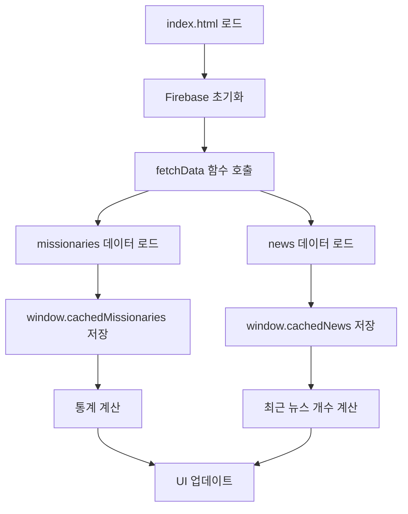
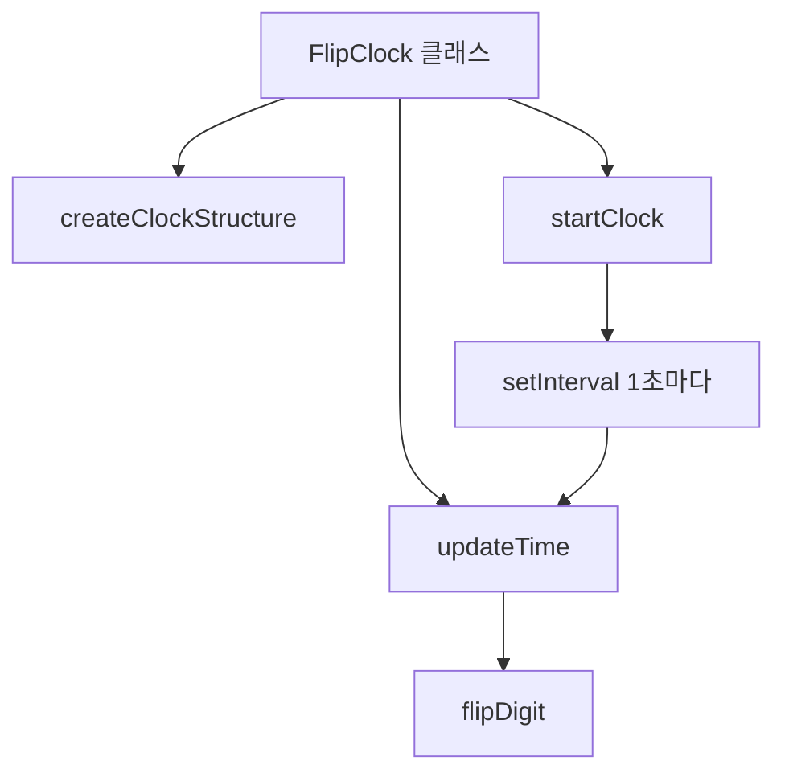
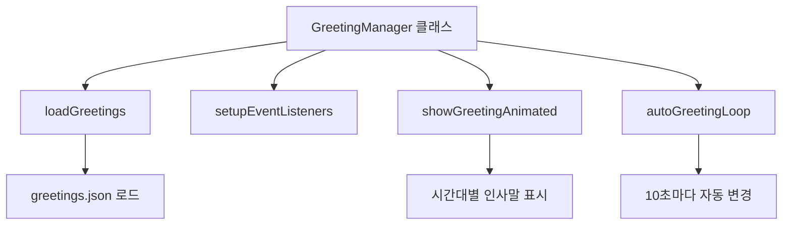
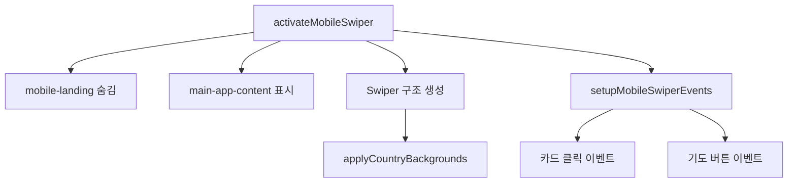
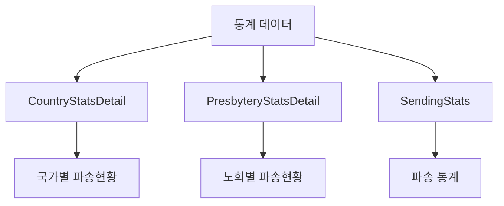
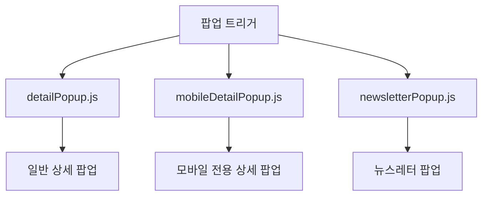

# Mobile 폴더 구조 및 함수 관계 분석

## 📁 폴더 구조

```
Mobile/
├── index.html                    # 모바일 앱 메인 진입점
├── flipclock.html               # 플립 시계 전용 페이지
├── swip.html                    # 스와이프 테스트 페이지
├── logo.svg                     # 앱 로고
├── logo-main.svg               # 메인 로고
├── README.md                    # 모바일 앱 설명서
├── README-greeting-system.md    # 인사말 시스템 설명서
├── css/                         # 스타일시트
│   ├── mobile.css              # 메인 모바일 스타일 (29KB)
│   ├── mobile-detail.css       # 상세보기 스타일 (13KB)
│   ├── greeting.css            # 인사말 스타일
│   ├── header.css              # 헤더 스타일
│   ├── flipclock-custom.css    # 플립 시계 커스텀 스타일
│   ├── presbytery-stats-luxury.css # 노회별 통계 스타일
│   ├── sending-stats.css       # 파송 통계 스타일
│   └── 100_logo.png           # 로고 이미지
├── js/                          # JavaScript 모듈
│   ├── utils.js                # 유틸리티 함수 및 데이터 로딩
│   ├── firebase-config.js      # Firebase 설정
│   ├── flipClock.js            # 플립 시계 클래스
│   ├── greetingManager.js      # 인사말 관리 클래스
│   ├── newsletterPopup.js      # 뉴스레터 팝업
│   ├── countryBackgrounds.js   # 국가별 배경/플래그 (19KB)
│   ├── countryFlags.json       # 국가별 플래그 데이터
│   ├── greetings.json          # 인사말 데이터
│   └── ui/                     # UI 컴포넌트
│       ├── detailPopup.js      # 상세 팝업 (8KB)
│       ├── mobileDetailPopup.js # 모바일 상세 팝업 (8.7KB)
│       ├── MobileMissionarySwiper.js # 선교사 스와이퍼 (14KB)
│       ├── MobileNewsSwip.js   # 뉴스 스와이퍼 (6.2KB)
│       ├── floatingMissionary.js # 플로팅 선교사
│       ├── CountryStatsDetail.js # 국가별 통계 상세
│       ├── PresbyteryStatsDetail.js # 노회별 통계 상세
│       └── SendingStats.js     # 파송 통계
└── vendor/                      # 외부 라이브러리
    ├── flipclock/              # 플립 시계 라이브러리
    ├── flipdown.min.js         # 카운트다운 라이브러리
    ├── flipdown.css            # 카운트다운 스타일
    ├── flipclock.es6.min.js    # ES6 플립 시계
    └── flipclock.es6.css       # ES6 플립 시계 스타일
```

## 🔄 함수간의 관계 및 데이터 흐름

### 1. 초기화 및 데이터 로딩



**주요 함수:**
- `window.fetchData(callback)` - Firebase에서 데이터 로드
- `window.isRecent(updateDate)` - 최근 업데이트 여부 확인
- `window.getLatLng(item, country, constants)` - 좌표 계산

### 2. 플립 시계 시스템



**주요 함수:**
- `FlipClock.constructor(container)` - 시계 초기화
- `FlipClock.updateTime()` - 시간 업데이트
- `FlipClock.flipDigit(digit, newValue)` - 숫자 플립 애니메이션

### 3. 인사말 시스템



**주요 함수:**
- `GreetingManager.getTimePeriod()` - 시간대별 구분 (morning/afternoon/evening)
- `GreetingManager.showGreetingAnimated()` - 인사말 애니메이션 표시
- `GreetingManager.handleUserInteraction()` - 사용자 상호작용 처리

### 4. 모바일 스와이퍼 시스템



**주요 함수:**
- `activateMobileSwiper(missionaries)` - 모바일 스와이퍼 활성화
- `formatMissionaryDate(lastUpdate)` - 날짜 포맷팅
- `getLatestNewsDate(missionaries)` - 최신 소식 날짜 계산
- `handleMobileCardPrayer(button, name, location)` - 기도 버튼 처리

### 5. 통계 시스템



**주요 함수:**
- `window.showCountryStatsDetail()` - 국가별 통계 상세보기
- `window.showPresbyteryStatsDetail()` - 노회별 통계 상세보기
- `countRecentNews(newsArray)` - 최근 3개월 뉴스 개수 계산

### 6. 팝업 시스템



**주요 함수:**
- `showDetailPopup(missionaryName, latlng)` - 상세 팝업 표시
- `showMobileDetailPopup(missionary)` - 모바일 상세 팝업 표시
- `showNewsletterPopup(newsletterUrl)` - 뉴스레터 팝업 표시

## 🔧 주요 모듈별 역할

### 1. **utils.js** - 핵심 유틸리티
- Firebase 데이터 로딩 (`fetchData`)
- 날짜 관련 유틸리티 (`isRecent`)
- 좌표 계산 (`getLatLng`)

### 2. **flipClock.js** - 시계 시스템
- 실시간 디지털 시계
- 플립 애니메이션 효과
- 1초마다 자동 업데이트

### 3. **greetingManager.js** - 인사말 시스템
- 시간대별 다국어 인사말
- 자동 순환 및 사용자 상호작용
- 애니메이션 효과

### 4. **MobileMissionarySwiper.js** - 메인 UI
- 선교사 카드 스와이퍼
- 국가별 배경 적용
- 기도 버튼 및 상세보기

### 5. **countryBackgrounds.js** - 국가별 배경
- 국가별 배경 이미지 관리
- 플래그 URL 생성
- 배경 적용 로직

## 📊 데이터 의존성

### Firebase 데이터 구조
```javascript
// missionaries 컬렉션
{
  name: "선교사 이름",
  country: "국가명",
  city: "도시명",
  organization: "기관명",
  presbytery: "노회명",
  lastUpdate: "2024-01-15",
  prayer: "기도제목",
  lat: 37.5665,
  lng: 126.9780
}

// news 컬렉션
{
  title: "뉴스 제목",
  content: "뉴스 내용",
  date: "2024-01-15"
}
```

### 전역 변수
- `window.cachedMissionaries` - 선교사 데이터 캐시
- `window.cachedNews` - 뉴스 데이터 캐시
- `window.cachedCountryStats` - 국가별 통계 캐시
- `window.cachedPresbyteryStats` - 노회별 통계 캐시

## 🎯 주요 기능별 구현

### 1. **랜딩 페이지**
- 플립 시계 표시
- 인사말 시스템
- 통계 요약 표시
- 로고 설정 패널

### 2. **선교사 스와이퍼**
- 수직 스와이프 네비게이션
- 국가별 배경 적용
- 기도 버튼 기능
- 상세보기 연결

### 3. **통계 시스템**
- 국가별/노회별 파송현황
- 실시간 데이터 연동
- 상세 통계 화면

### 4. **뉴스레터 시스템**
- 최근 3개월 뉴스 개수
- 뉴스레터 팝업
- 스와이프 네비게이션

## 🔄 이벤트 흐름

1. **페이지 로드** → Firebase 초기화 → 데이터 로드 → UI 렌더링
2. **통계 클릭** → 상세 통계 화면 표시
3. **선교사 카드 클릭** → 상세 팝업 표시
4. **기도 버튼 클릭** → 기도 카운트 증가 → 토스트 메시지
5. **스와이프** → 다음/이전 선교사 카드로 이동
6. **설정 버튼** → 로고 크기/투명도 설정 패널

## 🛠️ 개발 가이드

### 새로운 기능 추가 시
1. `js/ui/` 폴더에 새로운 컴포넌트 파일 생성
2. `index.html`에 스크립트 태그 추가
3. 필요한 경우 CSS 파일 추가
4. 전역 함수로 등록하여 다른 모듈에서 호출 가능하게 설정

### 데이터 수정 시
1. `utils.js`의 `fetchData` 함수에서 데이터 구조 확인
2. 필요한 경우 새로운 필드 추가
3. UI 컴포넌트에서 새로운 데이터 활용

### 스타일 수정 시
1. `css/mobile.css`에서 메인 스타일 수정
2. 컴포넌트별 스타일은 별도 CSS 파일로 관리
3. 반응형 디자인 고려 